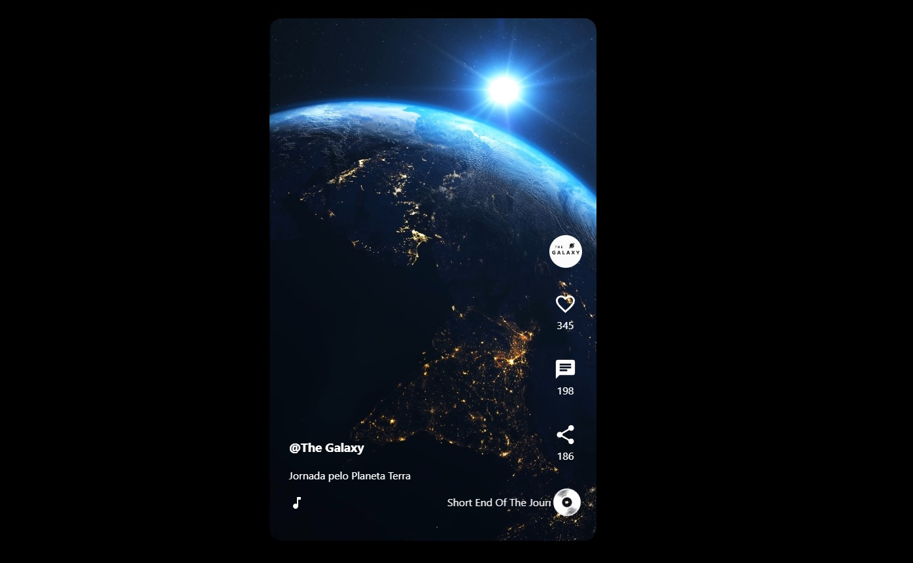

<h1 align="center"> Projeto "TikTok Clone" Jornada Dev EBAC </h1>

  <a href="#-tecnologias">Tecnologias</a>&nbsp;&nbsp;&nbsp;|&nbsp;&nbsp;&nbsp;
  <a href="#-projeto">Projeto</a>&nbsp;&nbsp;&nbsp;|&nbsp;&nbsp;&nbsp;
  <a href="#-arquivos">Arquivos</a>&nbsp;&nbsp;&nbsp;&nbsp;&nbsp;&nbsp;

 

  

## 🚀 Tecnologias

Esse projeto foi desenvolvido com as seguintes tecnologias:

- HTML e CSS
- JavaScript
- React
- Node
- Firebase

## 💻 Projeto

O projeto é um clone do TikTok para exibição de vídeos.   Desafio proposto e acompanhado pelo programa Jornada Full Stack Dev da EBAC.

- [Acesse o projeto finalizado, online](https://tiktok---jornada-b77e6.web.app/)

## 🔖 Arquivos

💿 [Link Vinil](https://poqlymuephttfsljdabn.supabase.co/storage/v1/object/public/jornadadev/vinil.png?t=2023-05-22T19%3A39%3A28.772Z)  
🎥 [Link Video 1](https://firebasestorage.googleapis.com/v0/b/tiktok---jornada-b77e6.appspot.com/o/Short%20End%20Of%20The%20Journey.mp4?alt=media&token=64822407-2983-4a07-bd49-6fe34eb5b109)  
🎥 [Link Video 2](https://firebasestorage.googleapis.com/v0/b/tiktok---jornada-b77e6.appspot.com/o/Short%20Birth%20Of%20The%20New%20Dream.mp4?alt=media&token=abeab49b-33a7-484f-b95a-b175f101cd1b)  
🎥 [Link Video 3](https://firebasestorage.googleapis.com/v0/b/tiktok---jornada-b77e6.appspot.com/o/Short%20Climb%20Ing%20Higher.mp4?alt=media&token=f1396292-12ea-44e9-a0e3-b08d1c5fb57c)  
🎥 [Link Video 4](https://firebasestorage.googleapis.com/v0/b/tiktok---jornada-b77e6.appspot.com/o/Short%20The%20Brave%20Heart.mp4?alt=media&token=3e6ba0c2-dd06-4ffe-bd9f-7e24bbed9952)  
🌠 [Link Logo](https://firebasestorage.googleapis.com/v0/b/tiktok---jornada-b77e6.appspot.com/o/Logo%20The%20Galaxy.png?alt=media&token=f2756f4a-fcfc-4534-a4b8-4825bf0ae37b)  

